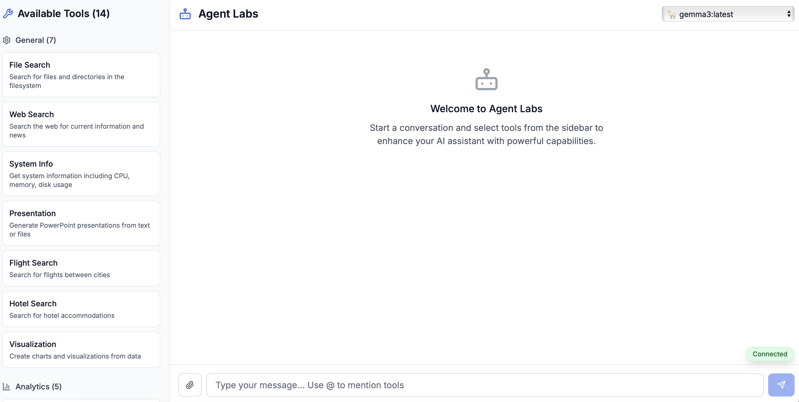
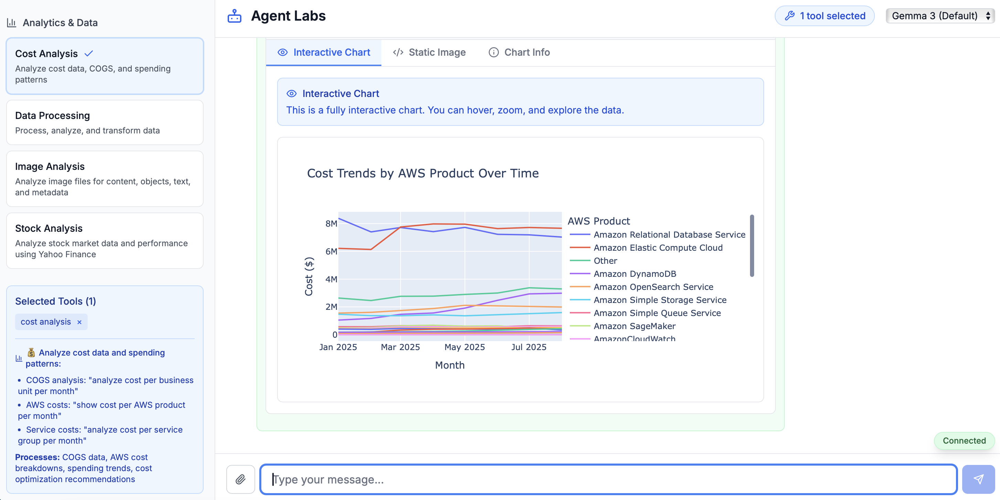
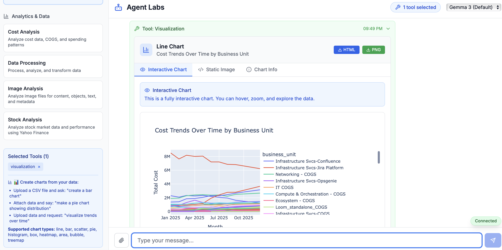
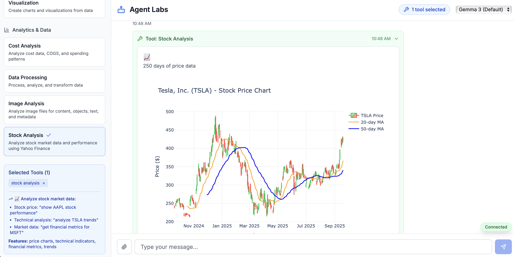
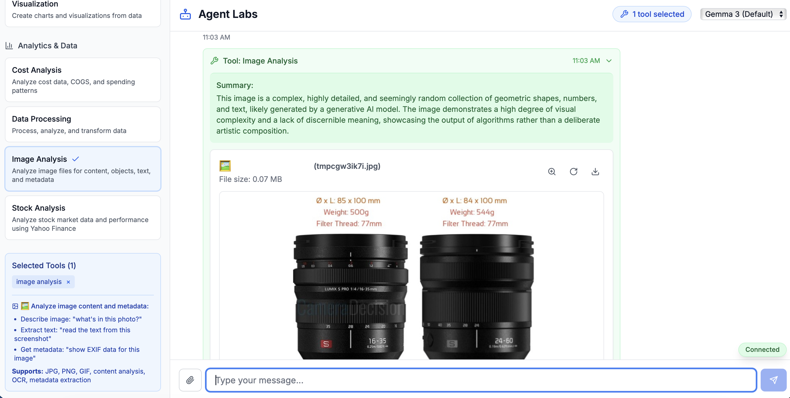
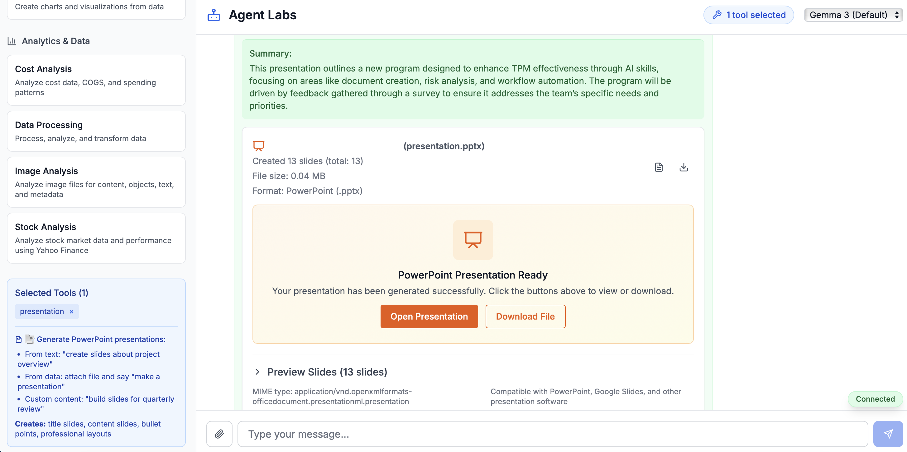

# Agent Labs

A modern AI-powered chat interface with intelligent multi-agent orchestration and real-time tool execution. Built with Next.js, FastAPI, and Ollama integration.



## Demo Screenshots

### Interactive Cost Analysis

*Real-time cost analysis with interactive line charts showing AWS spending trends over time*

### Data Visualization

*Create interactive charts from CSV data with full zoom, hover, and export capabilities*

### Stock Market Analysis

*Live stock data with candlestick charts and technical indicators*

## Features

- **Real-time Chat Interface**: WebSocket-based streaming communication with immediate response feedback
- **Intelligent Multi-Agent System**: Orchestrator pattern with specialized sub-agents for different tool categories
- **Tool Selection & Execution**: Dynamic tool selection with automatic parameter extraction and execution
- **File Upload Support**: Analyze images, process data files, and generate presentations from uploaded content
- **Rich Media Display**: Interactive charts, image analysis, and downloadable presentations in the chat interface
- **Multiple Model Support**: Compatible with various Ollama models (Gemma, Llama, Mistral, etc.)
- **Modern Responsive UI**: Clean interface built with React, Next.js, and Tailwind CSS
- **Smart Response Handling**: Direct pass-through for formatted responses, synthesis only when needed

## Architecture


### System Design

```
┌─────────────────┐    WebSocket    ┌──────────────────┐    HTTP/API    ┌─────────────┐
│  Next.js        │◄──────────────►│  FastAPI         │◄──────────────►│  Ollama     │
│  Frontend       │                │  Backend         │                │  LLM        │
│                 │                │                  │                │             │
│ - Chat UI       │                │ - WebSocket      │                │ - Models    │
│ - Tool Sidebar  │                │ - Multi-Agent    │                │ - Chat API  │
│ - File Upload   │                │ - Orchestrator   │                │             │
└─────────────────┘                └──────────────────┘                └─────────────┘
                                            │
                                            │
                                    ┌───────▼────────┐
                                    │  Sub-Agents    │
                                    │                │
                                    │ - FileSearch   │
                                    │ - WebSearch    │
                                    │ - SystemInfo   │
                                    │ - CostAnalysis │
                                    │ - Visualization│
                                    │ - Presentation │
                                    │ - CodeAnalysis │
                                    │ - ImageAnalysis│
                                    │ - DataProcess  │
                                    │ - StockAnalysis│
                                    └────────────────┘
```

### Communication Flow

1. **User Input** → Frontend captures message and selected tools with optional file attachments
2. **WebSocket** → Real-time bidirectional communication
3. **Orchestrator** → Analyzes query and selects appropriate sub-agents
4. **Initial Response** → Immediate acknowledgment sent to user
5. **Tool Execution** → Sub-agents execute tools with intelligent parameter extraction
6. **Real-time Updates** → Tool results streamed back to frontend with rich media display
7. **Response Handling** → Direct pass-through for formatted results, synthesis for raw data

### Multi-Agent Pattern

- **OrchestratorAgent**: Main coordinator that selects and manages sub-agents
- **Specialized Sub-Agents**: Each handles specific tool categories with domain expertise
- **Context Sharing**: Subsequent agents receive results from previous executions
- **Sequential Dependencies**: Agents can build upon each other's results

## Project Structure

```
agent_labs_ollama/
├── backend/
│   ├── main.py                     # FastAPI app with WebSocket endpoints
│   ├── multi_agent_system.py       # Main multi-agent system interface
│   ├── agents/
│   │   ├── __init__.py
│   │   ├── base_agent.py           # Base agent class with LLM integration
│   │   ├── orchestrator_agent.py   # Main orchestrator with callback support
│   │   ├── file_search_agent.py    # File system search operations
│   │   ├── web_search_agent.py     # Web search with Google API
│   │   ├── system_info_agent.py    # System metrics and information
│   │   ├── cost_analysis_agent.py  # Cost and spending analysis
│   │   ├── visualization_agent.py  # Chart creation and data visualization
│   │   ├── code_analysis_agent.py  # Code quality and security analysis
│   │   ├── data_processing_agent.py # Data analysis and transformation
│   │   ├── presentation_agent.py   # PowerPoint generation
│   │   ├── image_analysis_agent.py # Image content analysis
│   │   └── stock_analysis_agent.py  # Stock market analysis
│   ├── tools/
│   │   ├── file_search.py          # File system search implementation
│   │   ├── web_search.py           # Google Custom Search integration
│   │   ├── system_info.py          # System metrics collection
│   │   ├── cost_analysis.py        # Cost and spending analysis tools
│   │   ├── visualization.py        # Chart generation and visualization
│   │   ├── code_analysis.py        # Code analysis utilities
│   │   ├── data_processing.py      # Data manipulation tools
│   │   ├── presentation.py         # PowerPoint generation
│   │   ├── image_analysis.py       # Image processing and analysis
│   │   └── stock_analysis.py       # Stock market data analysis
│   └── requirements.txt            # Python dependencies
├── frontend/
│   ├── src/
│   │   ├── app/
│   │   │   ├── page.tsx            # Main application page
│   │   │   ├── layout.tsx          # Root layout
│   │   │   └── globals.css         # Global styles
│   │   ├── components/
│   │   │   ├── ChatInterface.tsx   # Main chat UI with file upload and rich media
│   │   │   ├── ToolSidebar.tsx     # Tool selection interface
│   │   │   ├── MessageBubble.tsx   # Individual message display
│   │   │   ├── StockChart.tsx      # Interactive stock chart display
│   │   │   ├── VisualizationChart.tsx # Interactive charts with full controls
│   │   │   ├── AnalyzedImage.tsx   # Image analysis with zoom and download
│   │   │   └── PresentationViewer.tsx # PowerPoint preview and download
│   │   ├── hooks/
│   │   │   ├── useWebSocket.ts     # WebSocket communication
│   │   │   └── messageReducer.ts   # Message state management
│   │   └── types/
│   │       └── index.ts            # TypeScript type definitions
│   ├── package.json                # Node.js dependencies
│   └── tailwind.config.js          # Tailwind CSS configuration
├── docker-compose.yml              # Multi-service Docker setup
├── Dockerfile.backend              # Backend container configuration
├── Dockerfile.frontend             # Frontend container configuration
└── README.md                       # Project documentation
```

## Available Tools

The tools are organized into two main categories accessible via the sidebar:

### General Tools
- **file_search**: Search for files and directories in the filesystem
  - Supports pattern matching and recursive search
  - Returns file paths, sizes, and modification dates

- **web_search**: Search the internet for current information
  - Google Custom Search API integration
  - Real-time web results with relevance ranking

- **system_info**: Comprehensive system metrics
  - CPU, memory, disk usage, and network information
  - Operating system details and hardware specifications

- **presentation**: Generate PowerPoint presentations
  - Intelligent slide creation with title and bullet point extraction
  - Template-based formatting and layout
  - Support for text files and markdown content
  - Downloadable .pptx files with slide preview in chat

### Analytics & Data Tools
- **cost_analysis**: Analyze cost data, COGS, and spending patterns
  - AWS cost breakdown and spending trends analysis
  - Interactive line charts showing cost trends over time by business unit or AWS product
  - Monthly cost growth analysis and optimization recommendations
  - Support for CSV files with time-series cost data

- **visualization**: Create charts from your data
  - Upload CSV files and generate interactive visualizations
  - Support for line charts, bar charts, scatter plots, pie charts, and histograms
  - Fully interactive charts with hover, zoom, and data exploration features
  - HTML and PNG download options for presentations and reports

- **code_analysis**: Analyze code files for quality and security
  - Security vulnerability detection
  - Code quality metrics and performance analysis
  - Support for multiple programming languages

- **image_analysis**: Analyze uploaded images
  - Comprehensive scene description and object detection
  - Text extraction (OCR) from images
  - Technical analysis including composition and quality
  - Interactive image display with zoom, rotation, and download

- **data_processing**: Process and analyze data files
  - CSV, JSON, and structured data analysis
  - Statistical operations and data transformation
  - Text analysis and pattern extraction

- **stock_analysis**: Analyze stock market data and performance
  - Real-time stock data from Yahoo Finance
  - Interactive candlestick charts with technical indicators
  - Technical analysis with RSI, moving averages, and Bollinger Bands
  - Risk metrics and investment recommendations
  - AI-powered market insights and trend analysis

## Quick Start

### Using Docker Compose (Recommended)

1. **Clone the repository**:
```bash
git clone <repository-url>
cd agent_labs_ollama
```

2. **Start all services**:
```bash
docker-compose up --build
```

3. **Access the application**:
   - Frontend: http://localhost:3000
   - Backend API: http://localhost:8000
   - Ollama API: http://localhost:11434

### Manual Setup

#### Prerequisites
- Python 3.9+
- Node.js 18+
- Ollama installed locally

#### Backend Setup

1. **Create virtual environment**:
```bash
cd backend
python -m venv .venv
source .venv/bin/activate  # On Windows: .venv\Scripts\activate
```

2. **Install dependencies**:
```bash
pip install -r requirements.txt
```

3. **Start the server**:
```bash
python main.py
```

#### Frontend Setup

1. **Install dependencies**:
```bash
cd frontend
npm install
```

2. **Start development server**:
```bash
npm run dev
```

#### Ollama Setup

1. **Install Ollama** following [official instructions](https://ollama.ai/)

2. **Pull recommended models**:
```bash
ollama pull gemma2:latest
ollama pull llama3.1:latest
ollama pull mistral:latest
```

3. **Start Ollama server**:
```bash
ollama serve
```

### Optional: Google Search API

For enhanced web search capabilities:

1. **Get Google API credentials**:
   - Visit [Google Cloud Console](https://console.cloud.google.com/)
   - Enable Custom Search API
   - Create API key and Search Engine ID

2. **Configure environment**:
```bash
# Backend .env file
GOOGLE_SEARCH_API_KEY=your_api_key_here
GOOGLE_SEARCH_ENGINE_ID=your_engine_id_here
```

## Usage


### Basic Chat
1. Open the application at http://localhost:3000
2. Select tools from the sidebar based on your needs
3. Type your message and press Enter
4. Watch as the AI orchestrator selects and executes appropriate tools

### File Upload & Analysis


1. Click the attachment icon in the chat input
2. Select an image, document, or data file
3. The system automatically chooses the appropriate analysis tool
4. Results include interactive displays:
   - **Images**: Zoomable analysis with download options
   - **Documents**: PowerPoint generation with slide previews
   - **Data files**: Statistical analysis and visualizations

### Example Interactions

**System Analysis**:
```
User: "What are my system specs and are there any performance issues?"

Orchestrator: I'll check your system information and analyze performance.

SystemInfoAgent: Retrieved system overview - macOS Darwin 25.0.0, ARM64, 16GB RAM
Result: CPU usage at 15%, Memory 8.2GB used (51%), Disk 85% full

Final Answer: Your MacBook Air is running well with moderate resource usage.
However, disk space is getting low at 85% capacity. Consider cleaning up
large files or moving data to external storage.
```

**Code Security Review**:
```
User: "Analyze the security of my authentication module"

Orchestrator: I'll perform a security analysis of your authentication code.

CodeAnalysisAgent: Scanning for security vulnerabilities...
Result: Found 3 issues: weak password hashing, missing rate limiting,
SQL injection vulnerability in login query

Final Answer: Critical security issues found. Recommend: 1) Upgrade to
bcrypt for password hashing, 2) Implement rate limiting with exponential
backoff, 3) Use parameterized queries to prevent SQL injection.
```

**Stock Market Analysis with Interactive Charts**:
```
User: "Analyze Apple stock performance over the last year"

Orchestrator: I'll analyze AAPL stock performance using market data.

StockAnalysisAgent: Retrieving Yahoo Finance data for AAPL...
[Interactive candlestick chart displayed in chat interface]

Result: Current price $189.50 (+12.3% YTD), RSI: 65 (neutral),
20-day MA: $185.20, Volatility: 23.4%, Recommendation: HOLD

AI Insights: Apple shows strong fundamentals with steady growth.
Recent momentum is positive but approaching overbought territory.
Consider taking profits if holding large positions.

Final Answer: Apple stock has performed well with 12.3% gains this year.
The interactive chart shows technical indicators and price action.
Stock is fairly valued at current levels around $189.50.
```

**Cost Analysis with Interactive Charts**:
```
User: [Uploads cost data CSV] "Show me cost trends per AWS product per month"

Orchestrator: I'll analyze the cost data and create interactive visualizations.

CostAnalysisAgent: Processing cost data and generating trend analysis...
[Interactive line chart displayed showing monthly cost trends by AWS product]

Analysis: Engineering costs highest at $3,300 total, with EC2 being the
primary driver. 17.4% cost growth from January to February, followed by
7.4% decrease in March.

Interactive Chart: Cost trends over time with hover details, zoom controls,
and download options (HTML/PNG) for presentations.

Recommendations: Focus on optimizing EC2 costs in Engineering.
Consider cost monitoring for periods with high growth rates.
```

**Data Visualization**:
```
User: [Uploads sales data] "Create a bar chart showing revenue by region"

Orchestrator: I'll create an interactive visualization of your sales data.

VisualizationAgent: Processing CSV data and generating chart...
[Interactive bar chart displayed with full controls]

Result: Revenue by region visualization with 4 regions and $2.3M total.
Interactive features include hover tooltips, zoom/pan, legend controls,
and export options.

Chart Type: Bar chart with 12 data points, downloadable as HTML or PNG.
```

**Image Analysis with Rich Display**:


```
User: [Uploads camera lens photo]

Orchestrator: I'll analyze the uploaded image for you.

ImageAnalysisAgent: Processing image content and metadata...
[Zoomable image displayed with analysis overlay]

Analysis: This image shows two Panasonic camera lenses - a 16-35mm f/4
and a 24-60mm f/2.8. The professional product photography features
clean composition on a dark reflective surface with studio lighting.

Interactive Features: Zoom, rotate, and download options available
in the chat interface for detailed examination.
```

**PowerPoint Generation**:


**Real-time Chat Interaction**:


## API Reference

### REST Endpoints

- `GET /api/tools` - List available tools
- `GET /api/models` - List available Ollama models
- `GET /health` - Health check

### WebSocket Protocol

Connect to `/ws/{client_id}` for real-time communication.

**Message Types**:
- `message_received` - Acknowledges user input
- `assistant_response_start` - Begin streaming response
- `assistant_response_chunk` - Response content chunk
- `assistant_response_complete` - Response finished
- `tool_result` - Tool execution result with structured data
- `tool_summary` - AI-generated summary of tool result (when needed)
- `error` - Error message

**Message Format**:
```json
{
  "type": "assistant_response_chunk",
  "content": "I'll analyze your system...",
  "timestamp": "2024-01-01T12:00:00Z"
}
```

## Configuration

### Environment Variables

**Backend** (`.env`):
```env
OLLAMA_BASE_URL=http://localhost:11434
GOOGLE_SEARCH_API_KEY=optional_api_key
GOOGLE_SEARCH_ENGINE_ID=optional_engine_id
LOG_LEVEL=INFO
```

**Frontend** (`.env.local`):
```env
NEXT_PUBLIC_API_URL=http://localhost:8000
NEXT_PUBLIC_WS_URL=ws://localhost:8000
```

### Model Configuration

The system supports any Ollama-compatible model. Configure in the frontend model selector or set default in backend configuration.

## Development

### Adding New Tools

1. **Create tool implementation** in `backend/tools/new_tool.py`
2. **Create specialized agent** in `backend/agents/new_tool_agent.py`
3. **Register agent** in `backend/agents/__init__.py`
4. **Add to orchestrator** in `backend/agents/orchestrator_agent.py`

**Example tool structure**:
```python
class NewToolAgent(BaseAgent):
    def execute(self, query: str) -> Dict[str, Any]:
        try:
            # Extract parameters using LLM
            params = self._extract_parameters(query)

            # Execute tool
            result = self._execute_tool_script("new_tool", params)

            return {
                "agent": "NewToolAgent",
                "tool": "new_tool",
                "success": True,
                "result": result,
                "timestamp": datetime.now().isoformat()
            }
        except Exception as e:
            return {"success": False, "error": str(e)}
```

### Frontend Development

The frontend uses modern React patterns:
- **TypeScript** for type safety
- **Custom hooks** for WebSocket communication
- **useReducer** for complex state management
- **Tailwind CSS** for styling

### Backend Development

The backend implements:
- **AsyncIO** for concurrent operations
- **WebSocket** for real-time communication
- **Pydantic** for data validation
- **Multi-agent pattern** for tool orchestration

## Contributing

1. Fork the repository
2. Create a feature branch (`git checkout -b feature/amazing-feature`)
3. Commit your changes (`git commit -m 'Add amazing feature'`)
4. Push to the branch (`git push origin feature/amazing-feature`)
5. Open a Pull Request

## License

This project is licensed under the MIT License - see the [LICENSE](LICENSE) file for details.