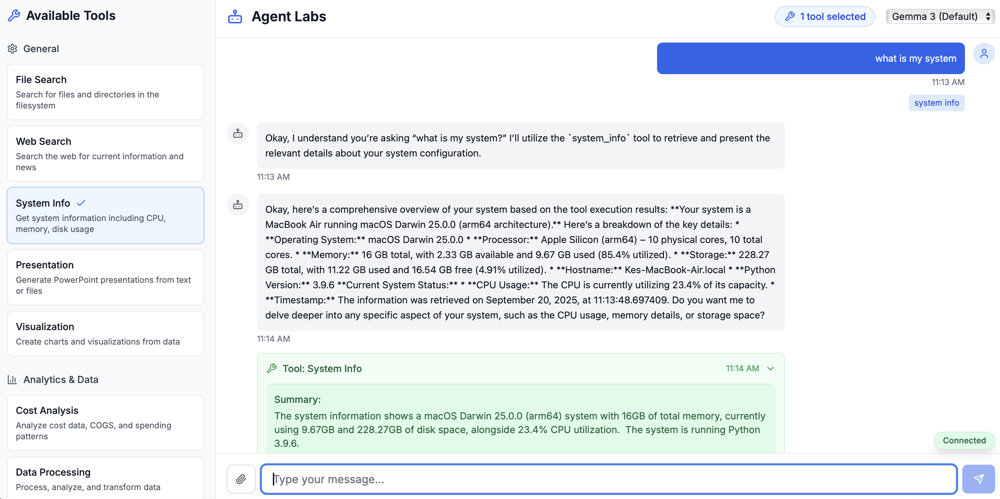
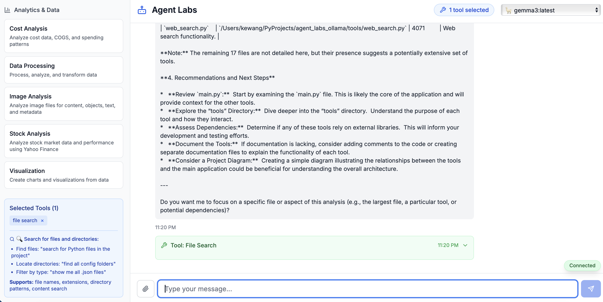
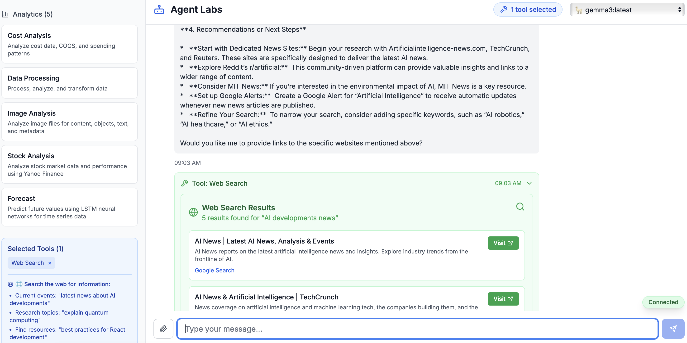
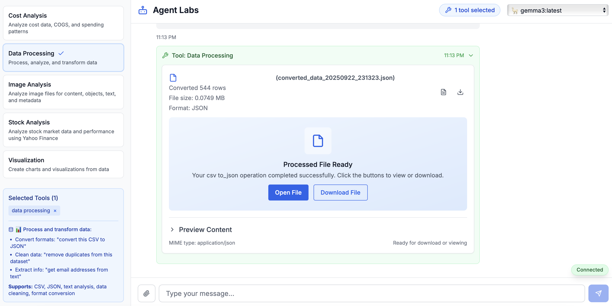

# Documentation

This directory contains all project documentation for Agent Labs.

## Screenshots & Demos

### Application Overview

*Main application interface with chat, tool sidebar, and real-time interactions*

### Interactive Features

#### Cost Analysis

*Real-time cost analysis with interactive line charts showing AWS spending trends over time*

#### Data Visualization

*Create interactive charts from CSV data with full zoom, hover, and export capabilities*

#### Stock Market Analysis

*Live stock data with candlestick charts and technical indicators*

#### Image Analysis

*Image analysis with zoom, rotation, and comprehensive metadata extraction*

#### PowerPoint Generation

*Automated PowerPoint generation with slide preview and download options*

#### System Information

*Real-time system monitoring with CPU, memory, disk usage, and performance metrics*

#### File Search

*Advanced file search with pattern matching, content filtering, and instant results*

#### Web Search

*Intelligent web search with result analysis and content extraction*

#### Data Processing

*Automated data cleaning, transformation, and processing with real-time feedback*

## Project Documentation

### Core Documentation
- **[Product Requirements Document (PRD)](./ollama-chat-agent-prd.md)** - Complete product specification and requirements
- **[Technical Context](./technical-context.md)** - Technical architecture and implementation details
- **[Feature Context](./feature-context.md)** - Feature specifications and functionality overview

### Research & Discovery
- **[Discovery Context](./discovery-context.md)** - Initial project discovery and research findings
- **[User Research Context](./user-research-context.md)** - User research, personas, and use cases
- **[UI/UX Specifications](./ui-ux-specifications.md)** - Design system and user interface specifications

### Visual Assets
- **[Images](./images/)** - Screenshots, diagrams, and visual documentation

## Quick Links

- [Main README](../README.md) - Project overview and getting started guide
- [Backend Documentation](../backend/) - API and backend implementation
- [Frontend Documentation](../frontend/) - UI components and frontend architecture

## Contributing to Documentation

When adding new documentation:
1. Use clear, descriptive filenames
2. Follow markdown best practices
3. Include relevant images in the `images/` directory
4. Update this index when adding new documents
5. Cross-reference related documents where appropriate

## Documentation Standards

- Use consistent heading structure (H1 for titles, H2 for major sections)
- Include table of contents for longer documents
- Use code blocks for technical examples
- Add screenshots for UI/UX elements
- Keep language clear and concise
- Include links to external resources where relevant