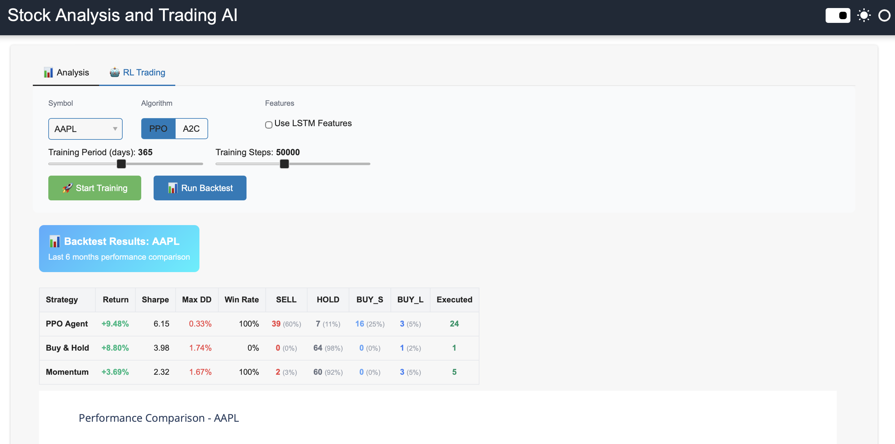

# 🤖 Stock Agent Pro

A professional financial analysis platform combining **AI-powered analysis**, **LSTM neural networks**, and **reinforcement learning** for comprehensive stock analysis, predictions, and automated trading strategies.


---

## 🎯 What It Does

### 📊 Professional Dashboard
- **Market Overview** with live major indices (S&P 500, NASDAQ, Dow Jones, Russell 2000)
- **Dynamic Watchlist** that automatically syncs with your portfolio, displaying real-time prices, daily changes, and key performance metrics for each stock.
- **Comprehensive Portfolio View** showing detailed metrics like Market Cap, P/E Ratio, Volume, and 52-Week Range for each holding in a compact, easy-to-read format.
- **Quick Actions** for common tasks (Train LSTM, Backtest, Compare, Report)
- **Light Theme** professional interface optimized for wide screens

### 📈 Stock Analysis & Prediction
- **Interactive Charts** with candlestick patterns and volume
- **Technical Indicators** (RSI, MACD, Bollinger Bands, Moving Averages)
- **30-Day LSTM Predictions** using ensemble neural networks (3 models)
- **AI-Powered Analysis** with natural language insights
- **Trading Signals** (BUY/SELL/HOLD) with confidence scores


*Stock analysis with interactive charts, technical indicators, and AI-powered insights*

### 🤖 Reinforcement Learning Trading
- **Train RL Agents** using PPO and A2C algorithms
- **LSTM Hybrid Architecture** for temporal pattern extraction
- **Comprehensive Backtesting** with automated model loading
- **Strategy Comparison** against Buy & Hold and Momentum baselines
- **Performance Metrics** (Returns, Sharpe Ratio, Max Drawdown, Win Rate)
- **Action Analysis** (SELL, HOLD, BUY_SMALL, BUY_LARGE distribution)


*Train and backtest RL agents with comprehensive performance metrics and strategy comparison*

### 🔴 Live Trading Simulation
- **Paper Trading** with real-time market data (Yahoo Finance)
- **Trained Agent Execution** using PPO/A2C models in live markets
- **Persistent Sessions** that can be resumed across application restarts, preserving your portfolio and trade history.
- **Real-time Portfolio Tracking** with live P&L updates
- **Risk Management** (stop-loss, position limits, circuit breakers)
- **Live Monitoring** with trading status, positions, and event log
- **Educational Platform** for safe strategy testing with virtual capital

### 🗂️ Model Registry
- **LSTM Models** with performance metrics (Final Loss, Val Loss)
- **RL Agents** with training dates and algorithm types
- **Model Management** with automatic discovery and organization

---

## 🚀 Quick Start

### 1. Install Dependencies
```bash
source .venv/bin/activate
pip install -r requirements.txt
```

### 2. Setup Ollama (Optional but Recommended)
```bash
# Install from https://ollama.ai
ollama pull gemma3:latest
```

### 3. Launch Platform
```bash
python src/main.py
# Open http://localhost:5006
```

### 4. Start Using

**Quick Market Check:**
- Open Dashboard → View market indices and watchlist

**Stock Analysis:**
- Click Analysis → Select symbol → Click Analyze
- Get charts, signals, LSTM predictions, and AI insights

**RL Training:**
- Click Trading → Configure agent → Start Training (5-10 min)
- Run Backtest → Compare strategies and metrics

**Live Trading:**
- Click Live Trade → Configure settings → Start Trading
- Monitor real-time portfolio, positions, and trades with virtual capital

**Model Management:**
- Click Models → View all trained LSTM and RL models

📖 **Detailed Guide**: See [QUICK_START.md](docs/QUICK_START.md) for step-by-step workflows

---

## 🏗️ Architecture

```
┌──────────────────────────────────────────────────────────────────────┐
│              Web Interface (Panel Dashboard)                          │
│  Light Theme • Wide Layouts • Responsive Design                       │
├──────────┬──────────┬──────────┬────────────┬──────────┬────────────┤
│Dashboard │ Analysis │ Training │ Live Trade │Portfolio │   Models   │
│• Markets │ • Charts │• RL Train│• Paper     │• Holdings│ • LSTM     │
│•Watchlist│ • Signals│• Backtest│• Real-time │• P&L     │ • RL       │
│• Actions │ • Predict│• Compare │• Risk Mgmt │• Metrics │ • Perf     │
└──────────┴──────────┴──────────┴────────────┴──────────┴────────────┘
              │                          │
              ▼                          ▼
┌──────────────────────────┐  ┌──────────────────────────────┐
│   Analysis Engine        │  │   RL Engine                  │
│   • Ollama AI            │  │   • Trading Environments     │
│   • LSTM Ensemble        │  │   • PPO/A2C Agents           │
│   • Technical Indicators │  │   • Backtest Engine          │
│   • Chart Generation     │  │   • Baseline Strategies      │
└──────────────────────────┘  └──────────────────────────────┘
              │                          │
              └──────────┬───────────────┘
                         ▼
              ┌─────────────────────────┐
              │   Data Layer            │
              │   • Yahoo Finance       │
              │   • Intelligent Caching │
              │   • Model Storage       │
              └─────────────────────────┘
```

**Technology Stack:**
- **AI**: Ollama (gemma3:latest) with regex fallback
- **ML**: TensorFlow LSTM ensemble models (3 models per symbol)
- **RL**: Stable-Baselines3 (PPO, A2C), Gymnasium environments
- **Data**: Yahoo Finance API with intelligent caching
- **UI**: Panel + Plotly interactive visualizations, light theme
- **Design**: Wide horizontal layouts, minimal scrolling

---

## 📁 Project Structure

```
stock_agent_ollama/
├── src/                # Core application source code
│   ├── agents/         # AI and query processing (Ollama)
│   ├── rl/             # Reinforcement Learning (training, backtesting)
│   ├── tools/          # Data fetching, analysis, and prediction tools (LSTM)
│   ├── ui/             # Web interface and user-facing pages
│   └── utils/          # Utility functions (e.g., caching)
├── data/               # Cached data, logs, and trained models
├── docs/               # Project documentation and screenshots
├── requirements.txt    # Python dependencies
└── README.md           # This file
```

---

## 📚 Documentation

### User Guides
- **[QUICK_START.md](docs/QUICK_START.md)** - Complete user guide with workflows and troubleshooting
- **[UX.md](docs/UX.md)** - Interface design, layouts, and component specifications

### Technical Documentation
- **[RL_DESIGN.md](docs/RL_DESIGN.md)** - RL architecture, algorithms, and design decisions
- **[LIVE_TRADE.md](docs/LIVE_TRADE.md)** - Live trading simulation system architecture

---

## ⚙️ Configuration

**Environment Variables:**
```bash
OLLAMA_MODEL=gemma3:latest          # AI model for analysis
OLLAMA_BASE_URL=http://localhost:11434
PANEL_PORT=5006                     # Web interface port
RL_DEFAULT_INITIAL_BALANCE=10000.0  # Starting balance
RL_TRANSACTION_COST_RATE=0.001      # 0.1% transaction cost
```

**Health Checks:**
```bash
# Test analysis engine
python -c "from src.agents.query_processor import QueryProcessor; print('✅ Ready')"

# Test RL engine
python -c "from src.rl import RLTrainer, BacktestEngine; print('✅ Ready')"

# Check Ollama (optional)
curl http://localhost:11434/api/tags
```

---

## 🎨 Interface Features

### Light Theme Design
- Professional white/light gray color scheme
- High contrast for readability
- Color-coded values (green=positive, red=negative)
- Clean, modern aesthetics

### Wide Horizontal Layouts
- Minimal vertical scrolling
- Better use of widescreen monitors
- Dashboard: Markets + Quick Actions side-by-side
- Analysis: 70/30 split (Chart + Signals/Predictions)
- Optimized for desktop and laptop screens

### Live Data Updates
- Real-time market indices (5-second refresh)
- Live watchlist prices with color-coded changes
- Interactive charts with hover details
- Auto-loading of trained models

### Model Registry
- **LSTM Models**: Shows Final Loss, Val Loss, training date
- **RL Agents**: Shows algorithm, symbol, training date
- Performance data generated via backtesting
- Automatic model discovery and organization

---

## 🛠️ Troubleshooting

| Issue | Solution |
|-------|----------|
| Import errors | `source .venv/bin/activate` + `pip install -r requirements.txt` |
| Ollama unavailable | Platform works with fallback mode (regex-based) |
| Port 5006 in use | Set `PANEL_PORT=5007` |
| Memory issues | Need 8GB+ RAM for RL training |
| RL training slow | Reduce steps to 30k or training period to 180 days |
| LSTM models empty | Run analysis once - auto-trains model (5-10 min) |
| RL shows "Run backtest →" | Normal - performance calculated during backtesting |

**More Help**: See [QUICK_START.md](docs/QUICK_START.md#troubleshooting)

---

## 📖 Key Features Explained

### LSTM Ensemble Predictions
- Trains 3 models per symbol for robustness
- 30-day price forecasts with confidence intervals
- Stored metadata includes Final Loss and Validation Loss
- Auto-training on first analysis request

### RL Trading Agents
- **PPO**: Proximal Policy Optimization (stable, recommended)
- **A2C**: Advantage Actor-Critic (faster, experimental)
- LSTM feature extraction for temporal patterns (optional)
- 4 action space: SELL, HOLD, BUY_SMALL, BUY_LARGE
- Realistic environment with transaction costs and slippage

### Backtesting System
- Auto-loads most recent trained RL agent
- Compares against Buy & Hold and Momentum baselines
- Comprehensive metrics: Returns, Sharpe, Sortino, Calmar ratios
- Action distribution analysis
- Portfolio value visualization over time

---

## 📖 Learning Objectives

**Stock Analysis & Prediction:**
- Technical indicators and their interpretation
- LSTM neural networks for time series forecasting
- Ensemble modeling for robust predictions
- AI-assisted financial analysis

**Reinforcement Learning Trading:**
- Policy optimization and actor-critic methods
- Trading environment design and reward engineering
- Risk-adjusted performance metrics
- Strategy comparison and evaluation
- Action space design for trading decisions

**Software Engineering:**
- Professional UX design patterns
- Real-time data handling and caching
- Model registry and management
- Wide layout optimization

---

## ⚠️ Important Disclaimer

**Educational Use Only**

This platform is designed for learning and research purposes:
- ✋ **NOT financial advice**
- ✋ **NOT for real trading decisions**
- ✋ Past performance does NOT guarantee future results
- ✋ RL agents trained on historical data may not work in live markets
- ✋ Always consult qualified financial professionals before making investment decisions

**Data Source**: Yahoo Finance (real-time, free, no API key required)

---

## 🎓 Perfect For

- **Students** learning AI/ML applications in finance
- **Researchers** exploring algorithmic trading strategies
- **Developers** studying RL implementations
- **Quantitative Analysts** experimenting with predictive models
- **Finance Professionals** understanding AI-driven analysis

Provides hands-on experience with modern algorithmic trading concepts in a safe, educational environment.

---

**Built for Financial AI & RL Education** 💙

*Comprehensive platform for learning stock analysis, LSTM predictions, and reinforcement learning trading strategies*