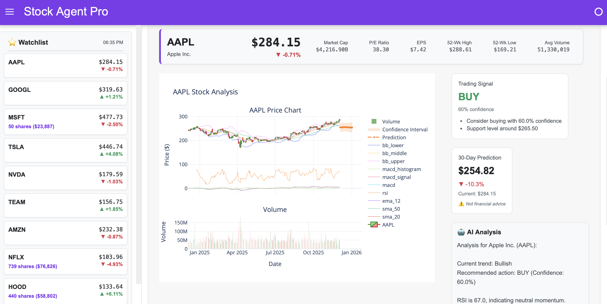
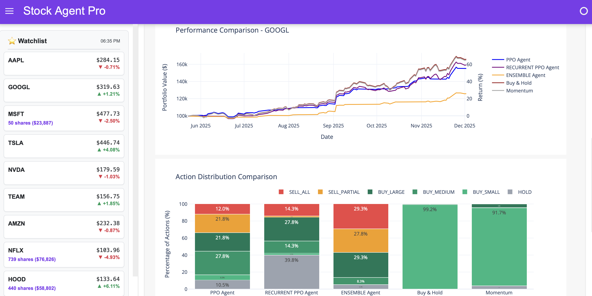
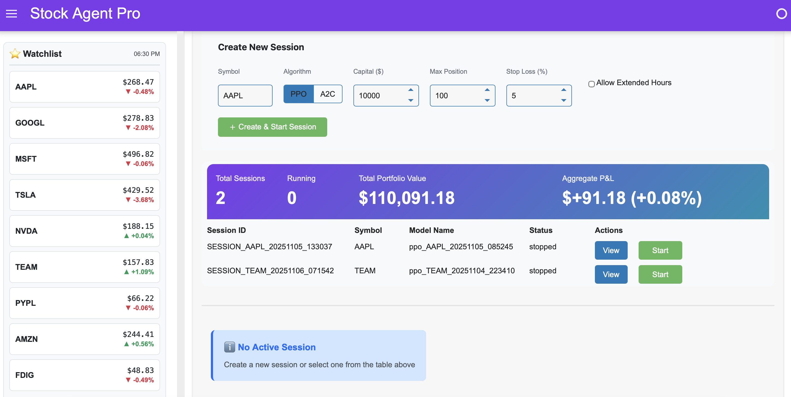
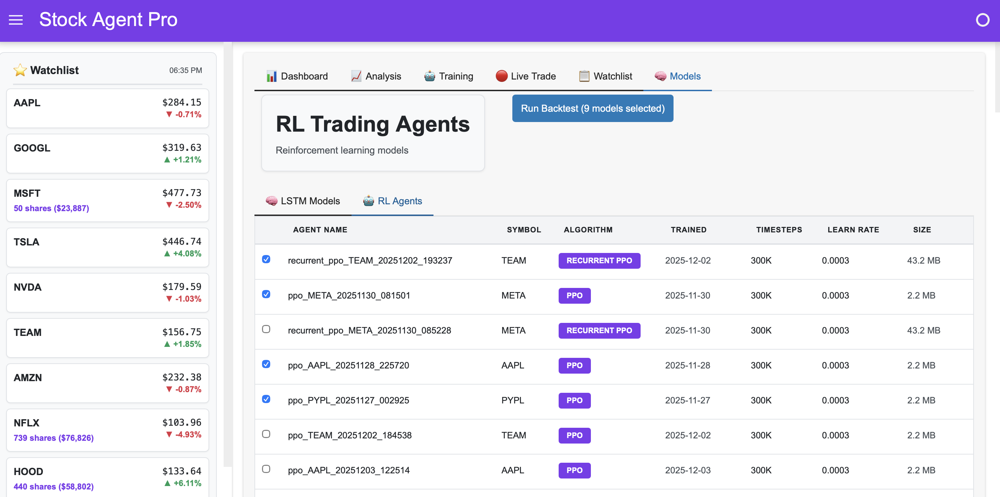

# 🤖 Stock Agent Pro

A professional financial analysis platform combining **AI-powered analysis**, **LSTM neural networks**, and **reinforcement learning** for comprehensive stock analysis, predictions, and automated trading strategies.


---

## 🎯 What It Does

### 📊 Professional Dashboard
- **Market Overview** with live major indices (S&P 500, NASDAQ, Dow Jones, Russell 2000)
- **Interactive Watchlist** in sidebar with clickable stock cards
  - Real-time prices and daily changes
  - Live position tracking from active trading sessions
  - Click any stock to instantly navigate to Analysis page
  - Automatic updates every 5 seconds
- **Quick Actions** for common tasks (Train LSTM, Backtest, Live Trading, Report)
- **Light Theme** professional interface optimized for wide screens

### 📈 Stock Analysis & Prediction
- **Interactive Charts** with candlestick patterns and volume
- **Technical Indicators** (RSI, MACD, Bollinger Bands, Moving Averages)
- **30-Day LSTM Predictions** using ensemble neural networks (3 models)
- **AI-Powered Analysis** with natural language insights
- **Trading Signals** (BUY/SELL/HOLD) with confidence scores


*Stock analysis with interactive charts, technical indicators, and AI-powered insights*

### 🤖 Reinforcement Learning Trading
- **Train RL Agents** using PPO, RecurrentPPO, and Ensemble with action masking
- **6-Action Trading Space** (HOLD, BUY_SMALL, BUY_MEDIUM, BUY_LARGE, SELL_PARTIAL, SELL_ALL)
- **RecurrentPPO** with LSTM memory for temporal pattern recognition
- **Trend Indicators** for RecurrentPPO (SMA_Trend, EMA_Crossover, Price_Momentum)
- **Advanced Risk Management** (stop-loss, trailing stops, circuit breakers)
- **Market Regime Detection** (BULL, BEAR, SIDEWAYS, VOLATILE)
- **Multi-Timeframe Features** (weekly/monthly trend analysis)
- **Kelly Position Sizing** (optimal position sizing based on edge)
- **Ensemble Agents** (combine multiple algorithms)
- **Adaptive Position Sizing** adjusts to market volatility
- **Training Metrics** (Win Rate, Action Distribution, Episode Rewards, Explained Variance)
- **Algorithm-Specific Rewards** optimized per algorithm
- **Comprehensive Backtesting** with automated model loading
- **Strategy Comparison** against Buy & Hold and Momentum
- **Performance Metrics** (Returns, Sharpe Ratio, Max Drawdown, Win Rate)
- **Visualization Charts** (Performance, Actions, Key metrics)


*Train and backtest RL agents with comprehensive performance metrics and strategy comparison*

### 🔴 Live Trading Simulation
- **Paper Trading** with real-time market data (Yahoo Finance)
- **Trained Agent Execution** using PPO, RecurrentPPO, or Ensemble models
- **Auto Stock Selection** dynamically rotates to best performing stocks
  - Intelligent model selection using composite scoring (algorithm type, recency, training quality)
  - Evaluates watchlist stocks based on 5-day performance
  - Rotation cooldown (10 cycles/10 minutes) to allow fair trading opportunities
  - Performance threshold (2% improvement) to prevent unnecessary rotation
  - Automatically selects best-performing algorithm per stock (prioritizes RecurrentPPO)
  - Maximizes capital efficiency across portfolio
- **Persistent Sessions** automatically save and resume
  - Portfolio state preserved
  - Trade history maintained
  - Configuration retained
  - Sessions sorted by creation time (newest first)
- **Real-time Portfolio Tracking** with live P&L updates
- **Risk Management** (stop-loss, position limits, circuit breakers)
- **Live Monitoring** with status, positions, and event log showing symbol-prefixed events
- **Educational Platform** for safe strategy testing


*Real-time paper trading with persistent sessions, portfolio tracking, and risk management*

### 🗂️ Model Registry
- **LSTM Models** with performance metrics (Final Loss, Val Loss)
- **RL Agents** with training dates and algorithm types
- **Batch Backtesting** with checkbox selection for multiple models
- **Model Management** with automatic discovery and organization
- **Chronological Ordering** with newest models displayed first for both LSTM and RL agents


*Model registry with LSTM and RL agent listings, batch backtesting with checkbox selection*

---

## 🚀 Quick Start

### 1. Install Dependencies
```bash
source .venv/bin/activate
pip install -r requirements.txt
```

### 2. Setup Ollama (Optional but Recommended)
```bash
# Install from https://ollama.ai
ollama pull gemma3:latest
```

### 3. Launch Platform
```bash
python src/main.py
# Open http://localhost:5006
```

### 4. Start Using

**Quick Market Check:**
- Open Dashboard → View market indices and watchlist

**Stock Analysis:**
- Click Analysis → Select symbol → Click Analyze
- Get charts, signals, LSTM predictions, and AI insights

**RL Training:**
- Click Trading → Configure agent → Start Training
- Default: 300,000 steps (recommended)
- PPO: 15-20 min (300k steps)
- RecurrentPPO: 25-35 min (LSTM needs more compute)
- Ensemble: 40-55 min (trains both PPO + RecurrentPPO)
- Run Backtest → Compare strategies and metrics

**Live Trading:**
- Click Live Trade → Configure settings → Start Trading
- Monitor real-time portfolio, positions, and trades with virtual capital

**Model Management:**
- Click Models → View all trained LSTM and RL models

📖 **Detailed Guide**: See [QUICK_START.md](docs/QUICK_START.md) for step-by-step workflows

---

## 🏗️ Architecture

```
┌──────────────────────────────────────────────────────────────────────┐
│              Web Interface (Panel Dashboard)                          │
│  Light Theme • Wide Layouts • Responsive Design                       │
├──────────┬──────────┬──────────┬────────────┬──────────┬────────────┤
│Dashboard │ Analysis │ Training │ Live Trade │Watchlist │   Models   │
│• Markets │ • Charts │• RL Train│• Paper     │• Prices  │ • LSTM     │
│•Watchlist│ • Signals│• Backtest│• Real-time │• Symbols │ • RL       │
│• Actions │ • Predict│• Compare │• Risk Mgmt │• Simple  │ • Tabs     │
└──────────┴──────────┴──────────┴────────────┴──────────┴────────────┘
              │                          │
              ▼                          ▼
┌──────────────────────────┐  ┌──────────────────────────────┐
│   Analysis Engine        │  │   RL Engine                  │
│   • Ollama AI            │  │   • Trading Environments     │
│   • LSTM Ensemble        │  │   • PPO/RecurrentPPO/        │
│   • Technical Indicators │  │     Ensemble Agents          │
│   • Chart Generation     │  │   • Backtest Engine          │
│                          │  │   • Baseline Strategies      │
└──────────────────────────┘  └──────────────────────────────┘
              │                          │
              └──────────┬───────────────┘
                         ▼
              ┌─────────────────────────┐
              │   Data Layer            │
              │   • Yahoo Finance       │
              │   • Intelligent Caching │
              │   • Model Storage       │
              └─────────────────────────┘
```

**Technology Stack:**
- **AI**: Ollama (gemma3:latest) with regex fallback
- **ML**: TensorFlow LSTM ensemble (3 models per symbol)
- **RL**: Stable-Baselines3 (PPO) + sb3-contrib (RecurrentPPO) + Custom Ensemble
- **Data**: Yahoo Finance with intelligent caching
- **UI**: Panel + Plotly, light theme, wide layouts

---

## 📁 Project Structure

```
stock_agent_ollama/
├── src/
│   ├── agents/           # AI query processing
│   ├── rl/               # RL training, backtesting, live trading
│   ├── tools/            # Data fetching, technical analysis, LSTM
│   └── ui/               # Web interface (Panel)
├── data/
│   ├── cache/            # Stock data cache
│   ├── models/           # Trained models (LSTM, RL)
│   ├── logs/             # Application logs
│   └── live_sessions/    # Trading session persistence
├── docs/                 # User guides and technical docs
└── requirements.txt
```

---

## 📚 Documentation

### User Guides
- **[QUICK_START.md](docs/QUICK_START.md)** - Complete user guide with workflows and troubleshooting
- **[UX.md](docs/UX.md)** - Interface design, layouts, and component specifications

### Technical Documentation
- **[RL_DESIGN.md](docs/RL_DESIGN.md)** - RL architecture, algorithms, and design decisions
- **[LIVE_TRADE.md](docs/LIVE_TRADE.md)** - Live trading simulation with session persistence

---

## ⚙️ Configuration

**Environment Variables:**
```bash
OLLAMA_MODEL=gemma3:latest           # AI model for analysis
OLLAMA_BASE_URL=http://localhost:11434
PANEL_PORT=5006                      # Web interface port
RL_DEFAULT_INITIAL_BALANCE=100000.0  # Starting balance ($100k)
RL_TRANSACTION_COST_RATE=0.0005      # 0.05% transaction cost
RL_MAX_POSITION_PCT=80.0             # Max position size (80% of portfolio)
RL_STOP_LOSS_PCT=0.05                # 5% stop-loss (default)
RL_TRAILING_STOP_PCT=0.03            # 3% trailing stop (default)
RL_MAX_DRAWDOWN_PCT=0.15             # 15% max drawdown (default)
```

**Health Checks:**
```bash
# Test analysis engine
python -c "from src.agents.query_processor import QueryProcessor; print('✅ Ready')"

# Test RL engine
python -c "from src.rl import EnhancedRLTrainer, BacktestEngine; print('✅ Ready')"

# Check Ollama (optional)
curl http://localhost:11434/api/tags
```

---

## 🛠️ Troubleshooting

| Issue | Solution |
|-------|----------|
| Import errors | `source .venv/bin/activate && pip install -r requirements.txt` |
| Port in use | Set `PANEL_PORT=5007` |
| Memory issues | Need 8GB+ RAM for RL training |
| Training slow | 300k steps recommended, reduce to 100k for quick tests |

See [QUICK_START.md](docs/QUICK_START.md#troubleshooting) for more help

---

## 📖 Key Features

**LSTM Predictions:**
- 3-model ensemble for robustness
- 30-day price forecasts
- Auto-training on first analysis

**RL Agents:**
- **PPO**: Stable baseline with balanced risk management
- **RecurrentPPO**: LSTM memory + trend indicators for temporal pattern recognition
- **Ensemble**: Weighted voting combining PPO (30%) + RecurrentPPO (70%)
- 6-action space with masking, adaptive sizing, algorithm-specific rewards

**Backtesting:**
- Auto-loads models
- Compares vs baselines (Buy & Hold, Momentum)
- Comprehensive metrics (Sharpe, Max Drawdown, Win Rate)

### 🛠️ Developer Tools

**Automated Training & Comparison:**
The `retrain_and_compare.py` CLI utility automates the entire workflow:
```bash
# Train all algorithms on a single stock
python retrain_and_compare.py --symbol AAPL

# Train specific algorithms on multiple stocks
python retrain_and_compare.py --symbol AMZN,AAPL,META --algorithms ensemble

# Train only PPO and Ensemble
python retrain_and_compare.py --symbol TSLA --algorithms ppo,ensemble

# Compare existing models without retraining
python retrain_and_compare.py --symbol MSFT --skip-training

# Skip baseline strategies in comparison
python retrain_and_compare.py --symbol NVDA --no-baselines
```

**Options:**
- `--symbol`: Single stock or comma-separated list (e.g., `AAPL` or `AAPL,TSLA,NVDA`)
- `--algorithms`: Comma-separated list of `ppo`, `recurrent_ppo`, `ensemble` (default: all)
- `--timesteps`: Training steps (default: 300,000)
- `--skip-training`: Only run backtest on existing models
- `--no-baselines`: Skip Buy & Hold and Momentum strategies

The tool handles model training, backtesting, and comprehensive strategy comparison automatically.

---

## ⚠️ Important Disclaimer

**Educational Use Only**

This platform is designed for learning and research purposes:
- ✋ **NOT financial advice**
- ✋ **NOT for real trading decisions**
- ✋ Past performance does NOT guarantee future results
- ✋ RL agents trained on historical data may not work in live markets
- ✋ Always consult qualified financial professionals before making investment decisions

**Data Source**: Yahoo Finance (real-time, free, no API key required)

---

## 🎓 Perfect For

Students, researchers, developers, quants, and finance professionals learning AI/ML trading in a safe educational environment.

---

**Built for Financial AI & RL Education** 💙

*Comprehensive platform for learning stock analysis, LSTM predictions, and reinforcement learning trading strategies*